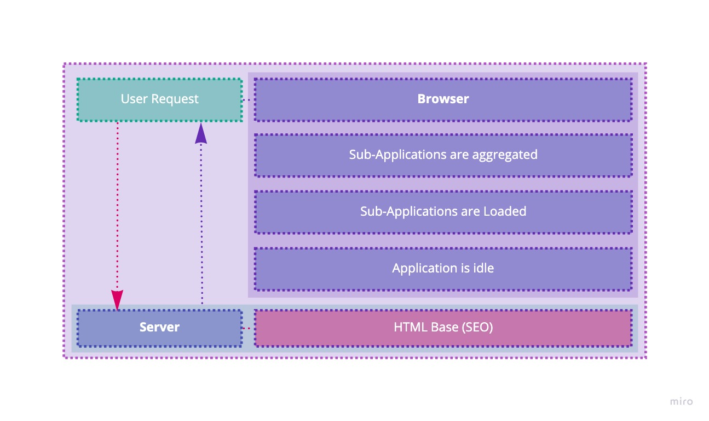

This project is meant to serve as my personal website but also will exist as a way to dogfood web tech ideas I find interesting.  I plan on implementing a runtime micro frontend to compose all of the different widgets in this app.

Here's an overview of the highly overengineered user request and system flow:

# Widget overview
Since this website's meant to be my personal site, I'll include the typical stuff (bio, projects, whatever) as well as some fun things I've just wanted to build.

**Standard Widgets**
- Bio
- Footer (or just copyright)
- Projects
- Contact
- Socials

**Non-standard Widgets**
- Snake game
- Step Sequencer
  - Controls
  - Synthesizer
  - Sequencer
- Synthesizer
- Weird interactive "art" widgets